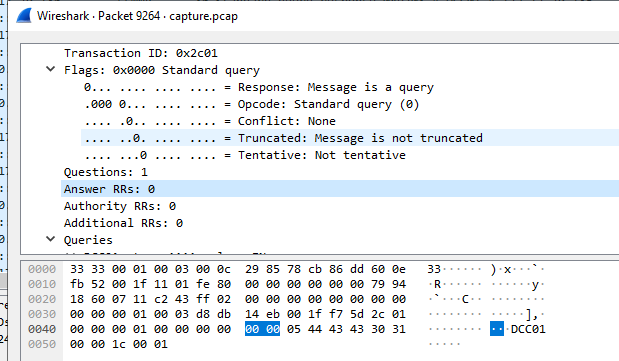
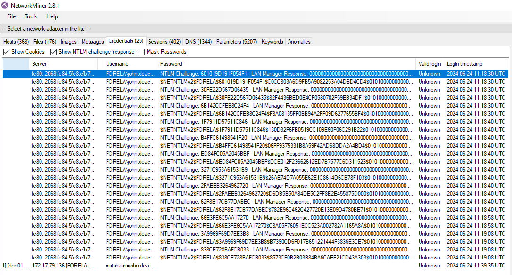
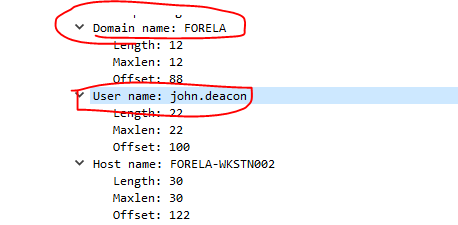

### Description
> The IDS device alerted us to a possible rogue device in the internal Active Directory network. The Intrusion Detection System also indicated signs of LLMNR traffic, which is unusual. It is suspected that an LLMNR poisoning attack occurred. The LLMNR traffic was directed towards Forela-WKstn002, which has the IP address 172.17.79.136. A limited packet capture from the surrounding time is provided to you, our Network Forensics expert. Since this occurred in the Active Directory VLAN, it is suggested that we perform network threat hunting with the Active Directory attack vector in mind, specifically focusing on LLMNR poisoning.

### Solution
- Đầu tiên, ta cần biết LLMNR và LLMNR poisoning attack là gì?
- Mình đã viết 1 bài research [tại đây](https://hackmd.io/@rz02Z9DaROCU7nExr7Inlg/SJ2ub8kc0)
- Bây giờ trả lời các câu hỏi trong bài.
#### Its suspected by the security team that there was a rogue device in Forela's internal network running responder tool to perform an LLMNR Poisoning attack. Please find the malicious IP Address of the machine.
- Đầu tiên, ta mở file được cho với wireshark và lọc theo giao thức LLMNR và theo dõi ip `172.17.79.136`
- 
- Thấy rằng sau khi ip `172.17.79.136` gửi yêu cầu truy vấn tên miền DCC01 cho ip `224.0.0.252` thì ip `172.17.79.135` trả về response.
- Thấy rằng ở gói `172.17.79.136 -> 224.0.0.252` không có phản hồi nào 
- 
- Còn đối với ip `172.17.79.135` thì báo rằng xác nhận tên miền của nó là DCC01 và cung cấp địa chỉ IP tương ứng. Khả năng cao đây là địa chỉ ip độc hại
> 172.17.79.135

#### What is the hostname of the rogue machine?
- Để tìm được host name ta sử dụng NetworkMiner

> kali
#### Now we need to confirm whether the attacker captured the user's hash and it is crackable!! What is the username whose hash was captured?
- Ta xem các gói SMB2
- 
- Thấy rằng user `john.deacon` từ domain `FORELA` thiết lập 1 phiên làm việc thông qua  `Session Setup`, tuy nhiên đã bị từ chối.

> john.deacon

#### In NTLM traffic we can see that the victim credentials were relayed multiple times to the attacker's machine. When were the hashes captured the First time?
- Chúng ta có thể biết được thời gian đầu tiên thông tin xác thực bị bắt với NetworkMiner 
- 
> 2024-06-24 11:18:30
- Ngoài ra ta cũng có thể xem với wrireshark 
- 
#### What was the typo made by the victim when navigating to the file share that caused his credentials to be leaked?
- 
- 
- Có vẻ tên chính xác là DC01 nhưng bị gõ nhầm thành DCC01.
> DCC01

#### To get the actual credentials of the victim user we need to stitch together multiple values from the ntlm negotiation packets. What is the NTLM server challenge value?
- Unpack đại 1 gói để xem dữ liệu bên trong 😉
```
Frame 9291: 412 bytes on wire (3296 bits), 412 bytes captured (3296 bits)
Ethernet II, Src: VMware_36:18:82 (00:0c:29:36:18:82), Dst: VMware_85:78:cb (00:0c:29:85:78:cb)
    Destination: VMware_85:78:cb (00:0c:29:85:78:cb)
    Source: VMware_36:18:82 (00:0c:29:36:18:82)
    Type: IPv6 (0x86dd)
Internet Protocol Version 6, Src: fe80::2068:fe84:5fc8:efb7, Dst: fe80::7994:1860:711:c243
Transmission Control Protocol, Src Port: 445, Dst Port: 51924, Seq: 481, Ack: 462, Len: 338
NetBIOS Session Service
    Message Type: Session message (0x00)
    Length: 334
SMB2 (Server Message Block Protocol version 2)
    SMB2 Header
    Session Setup Response (0x01)
        [Preauth Hash: 0b0624b1bfc6563c355447089f853d38ebb73f8f4a33369aa6978cff0a8bbab4d831b92a75a73e480e993accac3a88f44db5a2fac08d6944235bcf682e3ddd54]
        StructureSize: 0x0009
        Session Flags: 0x0000
        Blob Offset: 0x00000048
        Blob Length: 262
        Security Blob [truncated]: a18201023081ffa0030a0101a10c060a2b06010401823702020aa281e90481e64e544c4d53535000020000000800080038000000158289e2601019d191f054f10000000000000000a600a60040000000060380250000000f4e00420046005900020008004e0042004600
            GSS-API Generic Security Service Application Program Interface
                Simple Protected Negotiation
                    negTokenTarg
                        negResult: accept-incomplete (1)
                        supportedMech: 1.3.6.1.4.1.311.2.2.10 (NTLMSSP - Microsoft NTLM Security Support Provider)
                        responseToken [truncated]: 4e544c4d53535000020000000800080038000000158289e2601019d191f054f10000000000000000a600a60040000000060380250000000f4e00420046005900020008004e0042004600590001001e00570049004e002d00360036004100530035004c00310047005200
                        NTLM Secure Service Provider
                            NTLMSSP identifier: NTLMSSP
                            NTLM Message Type: NTLMSSP_CHALLENGE (0x00000002)
                            Target Name: NBFY
                                Length: 8
                                Maxlen: 8
                                Offset: 56
                            Negotiate Flags: 0xe2898215, Negotiate 56, Negotiate Key Exchange, Negotiate 128, Negotiate Version, Negotiate Target Info, Negotiate Extended Session Security, Target Type Domain, Negotiate Always Sign, Negotiate NTLM key, Negotiate Sign
                            NTLM Server Challenge: 601019d191f054f1
                            Reserved: 0000000000000000
                            Target Info
                            Version 6.3 (Build 9600); NTLM Current Revision 15
                                Major Version: 6
                                Minor Version: 3
                                Build Number: 9600
                                NTLM Current Revision: 15

```
> Thấy rằng NTLM Server Challenge là 601019d191f054f1
- Nếu chưa biết NTLM Server Challenge là gì thì xem lại [tại đây](https://hackmd.io/@rz02Z9DaROCU7nExr7Inlg/SJ2ub8kc0)
#### Now doing something similar find the NTProofStr value.
```
Frame 9292: 717 bytes on wire (5736 bits), 717 bytes captured (5736 bits)
Ethernet II, Src: VMware_85:78:cb (00:0c:29:85:78:cb), Dst: VMware_36:18:82 (00:0c:29:36:18:82)
    Destination: VMware_36:18:82 (00:0c:29:36:18:82)
    Source: VMware_85:78:cb (00:0c:29:85:78:cb)
    Type: IPv6 (0x86dd)
Internet Protocol Version 6, Src: fe80::7994:1860:711:c243, Dst: fe80::2068:fe84:5fc8:efb7
Transmission Control Protocol, Src Port: 51924, Dst Port: 445, Seq: 462, Ack: 819, Len: 643
NetBIOS Session Service
    Message Type: Session message (0x00)
    Length: 639
SMB2 (Server Message Block Protocol version 2)
    SMB2 Header
    Session Setup Request (0x01)
        [Preauth Hash: 5f165ff80d83c84541b67ee18c402ad5a5a976867d0870c9a4d1b87f83d853bc08311119bdb60a10a4007914697a27a29583bfe8db86efdcb9add4402bab355a]
        StructureSize: 0x0019
        Flags: 0
        Security mode: 0x01, Signing enabled
        Capabilities: 0x00000001, DFS
        Channel: None (0x00000000)
        Previous Session Id: 0x0000000000000000
        Blob Offset: 0x00000058
        Blob Length: 551
        Security Blob [truncated]: a18202233082021fa0030a0101a2820202048201fe4e544c4d535350000300000018001800980000003e013e01b00000000c000c005800000016001600640000001e001e007a00000010001000ee010000158288e20a00614a0000000fc61f5b5b17b538508c2e79b58a
            GSS-API Generic Security Service Application Program Interface
                Simple Protected Negotiation
                    negTokenTarg
                        negResult: accept-incomplete (1)
                        responseToken [truncated]: 4e544c4d535350000300000018001800980000003e013e01b00000000c000c005800000016001600640000001e001e007a00000010001000ee010000158288e20a00614a0000000fc61f5b5b17b538508c2e79b58a1ad2ea46004f00520045004c0041006a006f006800
                        NTLM Secure Service Provider
                            NTLMSSP identifier: NTLMSSP
                            NTLM Message Type: NTLMSSP_AUTH (0x00000003)
                            Lan Manager Response: 000000000000000000000000000000000000000000000000
                                Length: 24
                                Maxlen: 24
                                Offset: 152
                            LMv2 Client Challenge: 0000000000000000
                            NTLM Response [truncated]: c0cc803a6d9fb5a9082253a04dbd4cd4010100000000000080e4d59406c6da01cc3dcfc0de9b5f2600000000020008004e0042004600590001001e00570049004e002d00360036004100530035004c003100470052005700540004003400570049004e002d0036003600
                                Length: 318
                                Maxlen: 318
                                Offset: 176
                                NTLMv2 Response [truncated]: c0cc803a6d9fb5a9082253a04dbd4cd4010100000000000080e4d59406c6da01cc3dcfc0de9b5f2600000000020008004e0042004600590001001e00570049004e002d00360036004100530035004c003100470052005700540004003400570049004e002d00360036
                                    NTProofStr: c0cc803a6d9fb5a9082253a04dbd4cd4
                                    Response Version: 1
                                    Hi Response Version: 1
                                    Z: 000000000000
                                    Time: Jun 24, 2024 07:17:33.000000000 UTC
                                    NTLMv2 Client Challenge: cc3dcfc0de9b5f26
                                    Z: 00000000
                                    Attribute: NetBIOS domain name: NBFY
                                        NTLMV2 Response Item Type: NetBIOS domain name (0x0002)
                                        NTLMV2 Response Item Length: 8
                                        NetBIOS Domain Name: NBFY
                                    Attribute: NetBIOS computer name: WIN-66AS5L1GRWT
                                        NTLMV2 Response Item Type: NetBIOS computer name (0x0001)
                                        NTLMV2 Response Item Length: 30
                                        NetBIOS Computer Name: WIN-66AS5L1GRWT
                                    Attribute: DNS domain name: WIN-66AS5L1GRWT.NBFY.LOCAL
                                        NTLMV2 Response Item Type: DNS domain name (0x0004)
                                        NTLMV2 Response Item Length: 52
                                        DNS Domain Name: WIN-66AS5L1GRWT.NBFY.LOCAL
                                    Attribute: DNS computer name: NBFY.LOCAL
                                        NTLMV2 Response Item Type: DNS computer name (0x0003)
                                        NTLMV2 Response Item Length: 20
                                        DNS Computer Name: NBFY.LOCAL
                                    Attribute: DNS tree name: NBFY.LOCAL
                                        NTLMV2 Response Item Type: DNS tree name (0x0005)
                                        NTLMV2 Response Item Length: 20
                                        DNS Tree Name: NBFY.LOCAL
                                    Attribute: Timestamp
                                        NTLMV2 Response Item Type: Timestamp (0x0007)
                                        NTLMV2 Response Item Length: 8
                                        Timestamp: Jun 24, 2024 14:17:33.000000000 SE Asia Standard Time
                                    Attribute: Flags
                                        NTLMV2 Response Item Type: Flags (0x0006)
                                        NTLMV2 Response Item Length: 4
                                        Flags: 0x00000002
                                    Attribute: Restrictions
                                        NTLMV2 Response Item Type: Restrictions (0x0008)
                                        NTLMV2 Response Item Length: 48
                                        Restrictions: 30000000000000000000000000200000eb2ecbc5200a40b89ad5831abf821f4f20a2c7f352283a35600377e1f294f1c9
                                    Attribute: Channel Bindings
                                        NTLMV2 Response Item Type: Channel Bindings (0x000a)
                                        NTLMV2 Response Item Length: 16
                                        Channel Bindings: 00000000000000000000000000000000
                                    Attribute: Target Name: cifs/DCC01
                                        NTLMV2 Response Item Type: Target Name (0x0009)
                                        NTLMV2 Response Item Length: 20
                                        Target Name: cifs/DCC01
                                    Attribute: End of list
                                        NTLMV2 Response Item Type: End of list (0x0000)
                                        NTLMV2 Response Item Length: 0
                                    padding: 00000000
                            Domain name: FORELA
                                Length: 12
                                Maxlen: 12
                                Offset: 88
                            User name: john.deacon
                                Length: 22
                                Maxlen: 22
                                Offset: 100
                            Host name: FORELA-WKSTN002
                                Length: 30
                                Maxlen: 30
                                Offset: 122
                            Session Key: ef35d3c937f6b168ce0754f1c4fe143f
                                Length: 16
                                Maxlen: 16
                                Offset: 494
                             [truncated]Negotiate Flags: 0xe2888215, Negotiate 56, Negotiate Key Exchange, Negotiate 128, Negotiate Version, Negotiate Target Info, Negotiate Extended Session Security, Negotiate Always Sign, Negotiate NTLM key, Negotiate Sign, Request
                            Version 10.0 (Build 19041); NTLM Current Revision 15
                                Major Version: 10
                                Minor Version: 0
                                Build Number: 19041
                                NTLM Current Revision: 15
                            MIC: c61f5b5b17b538508c2e79b58a1ad2ea
                        mechListMIC: 01000000fdf65edfadc42c6400000000
                        NTLMSSP Verifier
                            Version Number: 1
                            Verifier Body: fdf65edfadc42c6400000000

```
- Tương tự với NTProofStr 
> c0cc803a6d9fb5a9082253a04dbd4cd4

#### To test the password complexity, try recovering the password from the information found from packet capture. This is a crucial step as this way we can find whether the attacker was able to crack this and how quickly.
- Ta sẽ khôi phục lại bằng cách crack hàm băm của nó, cấu trúc hàm băm là 
```User::Domain:ServerChallenge:NTProofStr:NTLMv2Response```
- Lại nhờ đến NetworkMiner cho nhanh
- 
```
$NETNTLMv2$FORELA$30FE22D567D06435$82F4436BED0E4CF0580702F59EB34DF1$010100000000000080E4D59406C6DA0176DCAD34579D163600000000020008004E0042004600590001001E00570049004E002D00360036004100530035004C003100470052005700540004003400570049004E002D00360036004100530035004C00310047005200570054002E004E004200460059002E004C004F00430041004C00030014004E004200460059002E004C004F00430041004C00050014004E004200460059002E004C004F00430041004C000700080080E4D59406C6DA0106000400020000000800300030000000000000000000000000200000EB2ECBC5200A40B89AD5831ABF821F4F20A2C7F352283A35600377E1F294F1C90A001000000000000000000000000000000000000900140063006900660073002F00440043004300300031000000000000000000
```
- Có vẻ như format không đúng lắm, Domain và username cũng không đúng, sửa lại 1 tí 
- 
```
john.deacon::FORELA:30FE22D567D06435$82F4436BED0E4CF0580702F59EB34DF1:010100000000000080E4D59406C6DA0176DCAD34579D163600000000020008004E0042004600590001001E00570049004E002D00360036004100530035004C003100470052005700540004003400570049004E002D00360036004100530035004C00310047005200570054002E004E004200460059002E004C004F00430041004C00030014004E004200460059002E004C004F00430041004C00050014004E004200460059002E004C004F00430041004C000700080080E4D59406C6DA0106000400020000000800300030000000000000000000000000200000EB2ECBC5200A40B89AD5831ABF821F4F20A2C7F352283A35600377E1F294F1C90A001000000000000000000000000000000000000900140063006900660073002F00440043004300300031000000000000000000
```
- OK, giờ bỏ vô john để crack
```
┌──(kali㉿kali)-[~/Downloads]
└─$ john --wordlist=/usr/share/wordlists/rockyou.txt hash
Using default input encoding: UTF-8
Loaded 1 password hash (netntlmv2, NTLMv2 C/R [MD4 HMAC-MD5 32/64])
Will run 4 OpenMP threads
Press 'q' or Ctrl-C to abort, almost any other key for status
NotMyPassword0k? (john.deacon)     
1g 0:00:00:11 DONE (2024-08-06 09:59) 0.08382g/s 903489p/s 903489c/s 903489C/s Nov11992..Nme%%%%%
Use the "--show --format=netntlmv2" options to display all of the cracked passwords reliably
Session completed. 

```
> NotMyPassword0k?
#### Just to get more context surrounding the incident, what is the actual file share that the victim was trying to navigate to?
- Nhìn vào dữ liệu từ smb2 protocol, ta có thể dễ dàng xác định được file thực sự victim share là `\\DC01\DC-Confidential`