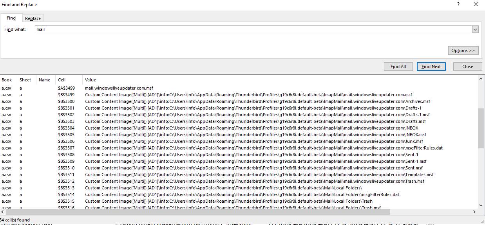
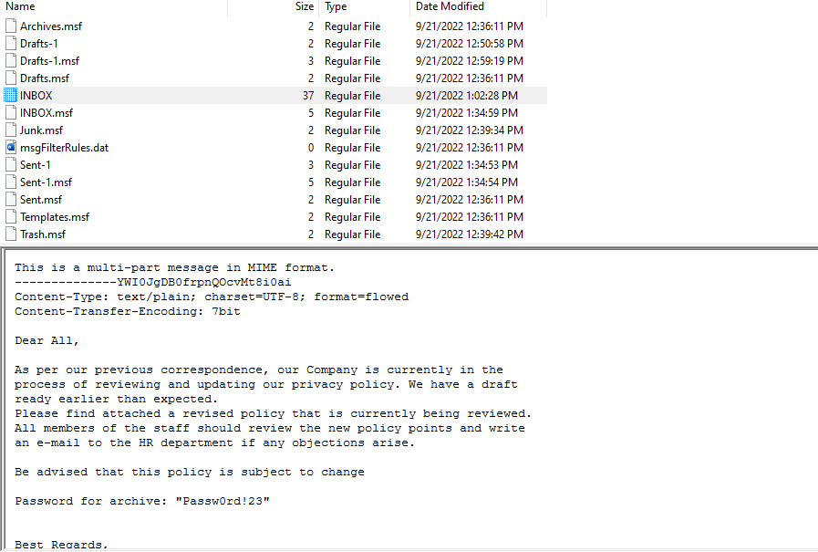
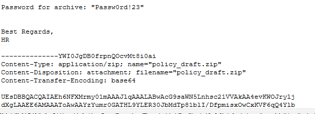
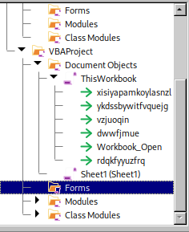
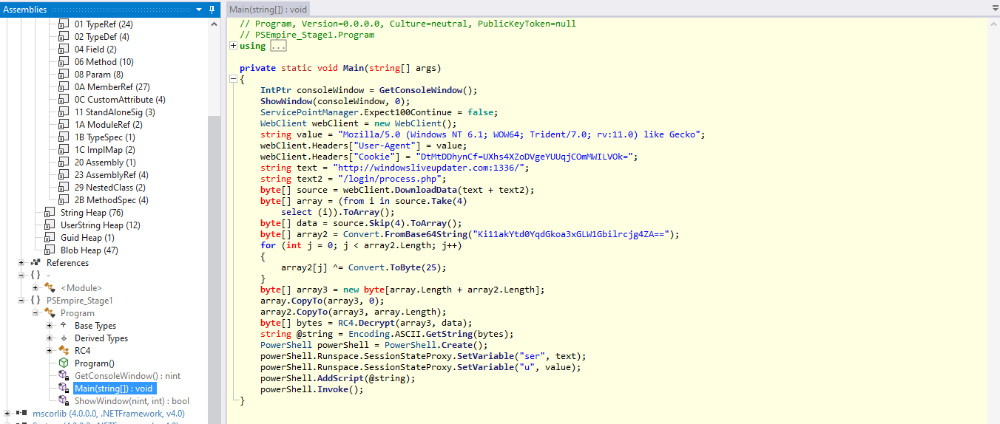

## Giới thiệu 
> You got Mail là một challenge có độ khó Medium, nằm trong mảng Forensics (điều tra số), mô phỏng lại một Incident (sự cố) khi công ty X phát hiện ra máy tính của một nhân viên trong công ty bị dính mã độc. Team IR (Incident Response) đã ngay lập tức thu thập chứng cứ trên máy tính này. Nhiệm vụ của chúng ta là phải tìm hiểu xem mã độc thâm nhập vào bằng cách nào (với tiêu đề như trên thì chắc là qua email rồi) và chuyện gì đã xảy ra. Let’s go~
## Đề bài 
> Bạn có thể tải backup đề bài về tại đây: https://mega.nz/file/D08wnIDa#aZzUc9FNJJLSF1xWjd8B2YD_HCpVnStbemXfkEeQjBY (1.3Gb)
## Giải
- Sau khi tải ta thu được 1 file có tên `case_1.ad1`
- Kiểm tra xem đó là loại file gì bằng command `file`
```text
┌──(trongtam㉿kali)-[~/Downloads]
└─$ file case_1.ad1                                              
case_1.ad1: data
```
- Không thu được kết quả gì, tôi tiếp tục với hex để kiểm tra header của file 
> hexeditor case_1.ad1 | head
- Ta thu được header có strings như sau `ADSEGMENTEDFILE`
- Tìm kiếm trên google cả 2 (strings trong hexeditor và đuôi .ad1) ta có thể tìm được thông tin [tại đây](https://fileinfobase.com/vi/extension/ad1)
- Theo thông tin ta tìm được thì đây là 1 file từ công cụ phân tích pháp y FTK image 
- Tôi sẽ mở file trên công cụ này 

- Có thể thấy, có rất nhiều folder nên khó lòng kiểm tra hết 
- Tôi sẽ export nó ra 1 list để dễ dàng hơn trong việc tìm kiếm 
> File > export directory list
- Sau khi export ra 1 file excel tôi sẽ tìm kiếm 1 vài từ liên quan như mail, Thunderbird, Outlook, ...
- Sau khi tìm 1 lúc tôi thấy nó đều chỉ đến 1 đường dẫn `\info:C:\Users\info\AppData\Roaming\Thunderbird\Profiles\g19c6r8i.default-beta\ImapMail\`

- Truy cập đường dẫn trên tôi thấy được email mà hacker đã gửi

- Ở bên dưới có kèm 1 tập tin đính kèm bị khoá bởi mật khẩu là `Passw0rd!23` và mã hoá base64

- Bây giờ tôi sẽ xem trong tệp đính kèm có gì không 
- Để xem được ta phải dựng lại tệp đính kềm từ đoạn mã hoá base64
- Copy phần mở rộng và decode nó 
> base64 -d a.txt > policy_draft.zip
- Tôi thu được 1 tệp
- Giải nén ra thì thu được 1 file policy.xlsm

- Chữ m đằng sau đuôi file đại diện cho file chứa macros bên trong 

- Bên trong cũng chứa cảnh báo macros
- Đây là macros bên trong

- Để phân tích macros của file ta dùng công cụ `olevba.py`
> olevba policy.xlsm 
```text
-------------------------------------------------------------------------------
VBA MACRO Sheet1.cls 
in file: xl/vbaProject.bin - OLE stream: 'VBA/Sheet1'
- - - - - - - - - - - - - - - - - - - - - - - - - - - - - - - - - - - - - - - 
(empty macro)
+----------+--------------------+---------------------------------------------+
|Type      |Keyword             |Description                                  |
+----------+--------------------+---------------------------------------------+
|AutoExec  |Workbook_Open       |Runs when the Excel Workbook is opened       |
|Suspicious|Open                |May open a file                              |
|Suspicious|Write               |May write to a file (if combined with Open)  |
|Suspicious|SaveToFile          |May create a text file                       |
|Suspicious|Create              |May execute file or a system command through |
|          |                    |WMI                                          |
|Suspicious|Call                |May call a DLL using Excel 4 Macros (XLM/XLF)|
|Suspicious|MkDir               |May create a directory                       |
|Suspicious|CreateObject        |May create an OLE object                     |
|Suspicious|GetObject           |May get an OLE object with a running instance|
|Suspicious|Lib                 |May run code from a DLL                      |
|Suspicious|RtlMoveMemory       |May inject code into another process         |
|Suspicious|VirtualProtect      |May inject code into another process         |
|Suspicious|Chr                 |May attempt to obfuscate specific strings    |
|          |                    |(use option --deobf to deobfuscate)          |
|Suspicious|Xor                 |May attempt to obfuscate specific strings    |
|          |                    |(use option --deobf to deobfuscate)          |
|Suspicious|Hex Strings         |Hex-encoded strings were detected, may be    |
|          |                    |used to obfuscate strings (option --decode to|
|          |                    |see all)                                     |
|Suspicious|Base64 Strings      |Base64-encoded strings were detected, may be |
|          |                    |used to obfuscate strings (option --decode to|
|          |                    |see all)                                     |
|IOC       |update.exe          |Executable file name (obfuscation: Hex)      |
|Hex String|ntdll.d             |6e74646c6c2e64                               |
|Hex String|twEventWrite        |74774576656e745772697465                     |
|Hex String|winmgmts:{impersonat|77696e6d676d74733a7b696d706572736f6e6174696f6|
|          |ionLevel=impersonate|e4c6576656c3d696d706572736f6e6174652c61757468|
|          |,authent            |656e74                                       |
|Hex String|icationLevel=pktPriv|69636174696f6e4c6576656c3d706b745072697661637|
|          |acy}!\\.\root\cimv2 |97d215c5c2e5c726f6f745c63696d7632            |
|Hex String|Selec               |53656c6563                                   |
|Hex String|t * from            |74202a2066726f6d2057696e33325f436f6d707574657|
|          |Win32_ComputerSystem|253797374656d                                |
|Hex String|VIRTUA              |564952545541                                 |
|Hex String|gth variable must be|677468207661726961626c65206d75737420626520677|
|          |greater than 0      |26561746572207468616e2030                    |
|Hex String|https://win         |68747470733a2f2f77696e                       |
|Hex String|dowsliveupdater.com/|646f77736c697665757064617465722e636f6d2f75706|
|          |update.exe          |46174652e657865                              |
|Hex String|crosoft.XMLHTTP     |63726f736f66742e584d4c48545450               |
|Hex String|\{0}.exe            |5c7b307d2e657865                             |
|Hex String|ODB.Stream          |4f44422e53747265616d                         |
|Hex String|Schedule.Servi      |5363686564756c652e5365727669                 |
|Hex String|rosoft Corporation  |726f736f667420436f72706f726174696f6e         |
|Hex String|imeTriggerId        |696d65547269676765724964                     |
|Hex String|Upda                |55706461                                     |
|Hex String|teTask              |74655461736b                                 |
+----------+--------------------+---------------------------------------------+

```
- Tại đây có 1 vài file exe và 1 đống kí tự bị mã hoá hex 
```text
|Hex String|gth variable must be|677468207661726961626c65206d75737420626520677|
|          |greater than 0      |26561746572207468616e2030                    |
|Hex String|https://win         |68747470733a2f2f77696e                       |
|Hex String|dowsliveupdater.com/|646f77736c697665757064617465722e636f6d2f75706|
|          |update.exe          |46174652e657865                              |
|Hex String|crosoft.XMLHTTP     |63726f736f66742e584d4c48545450               |
|Hex String|\{0}.exe            |5c7b307d2e657865                             |
|Hex String|ODB.Stream          |4f44422e53747265616d                         |
|Hex String|Schedule.Servi      |5363686564756c652e5365727669                 |
|Hex String|rosoft Corporation  |726f736f667420436f72706f726174696f6e         |
|Hex String|imeTriggerId        |696d65547269676765724964                     |
|Hex String|Upda                |55706461                                     |
|Hex String|teTask              |74655461736b                                 |
+----------+--------------------+---------------------------------------------+
```
- Mạnh dạn truy cập vào https://widowsliveupdater.com/update.exe xem có gì không.
- File backup xem [tại đây](https://mega.nz/file/v0E2hIIA#-uQESLcO4o7bpQmsvg1sVlLDo_qfrovZPQ28zqi9Z3w)
- Tải file về ta được 1 file update.exe
- Mở file .exe bằng ida để xem source code, nhưng bản free nó không cho =)))
- Ta sử dụng 1 công cụ khác tên `ILSpy`
- Sau khi mở file .exe thì em xem decompile

- Tôi thấy 1 đoạn base64 chỗ này
```text
	byte[] array2 = Convert.FromBase64String("Ki11akYtd0YqdGkoa3xGLW1Gbilrcjg4ZA==");
	for (int j = 0; j < array2.Length; j++)
	{
		array2[j] ^= Convert.ToByte(25);
	}
```
- Giải thích 1 chút thì nó sẽ chuyển chuỗi base64 ` Ki11akYtd0YqdGkoa3xGLW1Gbilrcjg4ZA==` thành từng byte và lưu trong biến array2
- Đưa vào vòng lặp khi chiều dài của array2 nhỏ hơn hoặc bằng biến j thì dừng
- Tiếp theo xor từng byte với 25
- Tôi sẽ viết code xor chúng ra
```text
import base64

# Chuỗi Base64 cần giải mã
base64_str = "Ki11akYtd0YqdGkoa3xGLW1Gbilrcjg4ZA=="

# Chuyển đổi chuỗi Base64 thành mảng byte
array2 = bytearray(base64.b64decode(base64_str))

# Vòng lặp để thực hiện phép XOR với giá trị 25
for j in range(len(array2)):
    array2[j] ^= 25

# In ra mảng đã được giải mã
print(array2)
```
- Sau khi chạy ta được 1 phần của flag : 34ls_4n_3mp1re_4t_w0rk!!}


- Ngồi 1 lát thì thấy đoạn này 
```text
Dim kzujiavquwjkahbl As Variant
kzujiavquwjkahbl = Array(223, 195, 213, 236, 246, 226, 227, 167, 231, 228, 238, 200, 167, 241, 200, 163, 249, 200, 166, 249, 245, 167, 239, 200, 229, 164, 225)
Dim wwiqwvyhemghupdahkj As Integer
wwiqwvyhemghupdahkj = 0
For i = 0 To 26
wwiqwvyhemghupdahkj = wwiqwvyhemghupdahkj + kzujiavquwjkahbl(i) Xor 151
```
- Đoạn này sẽ xor lần lượt có số trong list `223, 195, 213, 236, 246, 226, 227, 167, 231, 228, 238, 200, 167, 241, 200, 163, 249, 200, 166, 249, 245, 167, 239, 200, 229, 164, 225` với số `151`
- Ta sẽ viết 1 code đơn giản để xor bọn nó
```text
list = [223, 195, 213, 236, 246, 226, 227, 167, 231, 228, 238, 200, 167, 241, 200, 163, 249, 200, 166, 249, 245, 167, 239, 200, 229, 164, 225]
for i in list:
	print(chr(i ^ 151), end = '')
```
> Kết quả ta được đầu flag : HTB{aut0psy_0f_4n_1nb0x_r3v
- Ghép 2 phần lại với nhau ta sẽ được flag 
> Flag : HTB{aut0psy_0f_4n_1nb0x_r3v34ls_4n_3mp1re_4t_w0rk!!}

