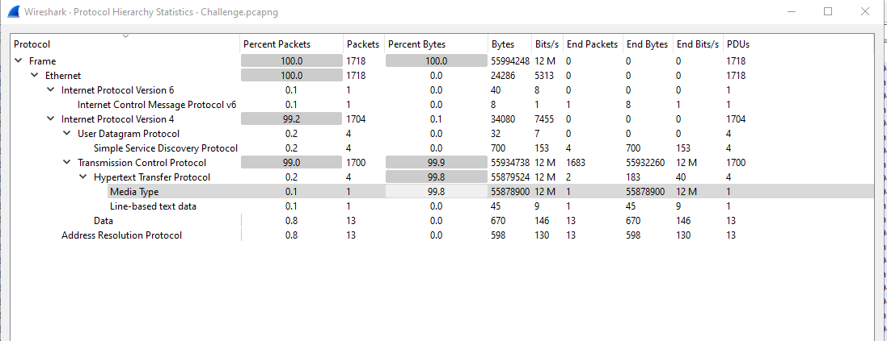
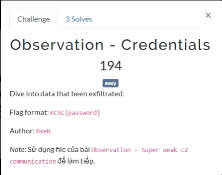
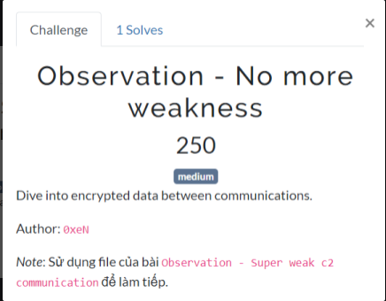
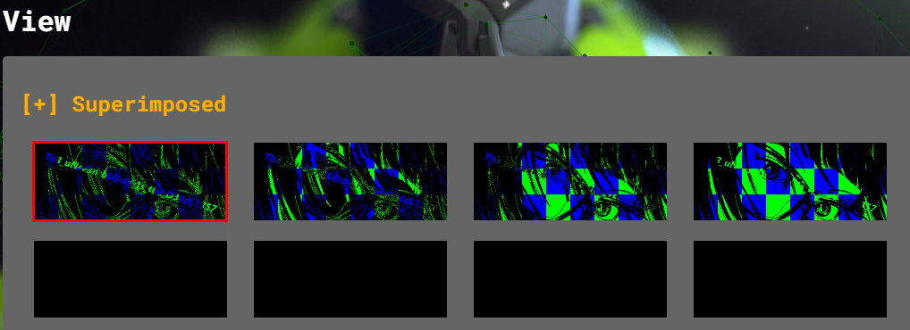
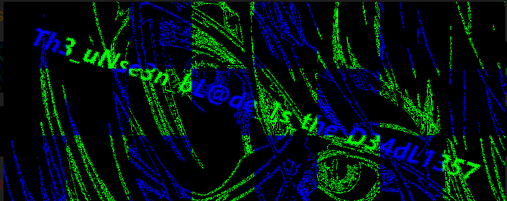
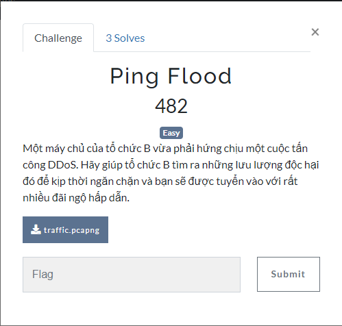
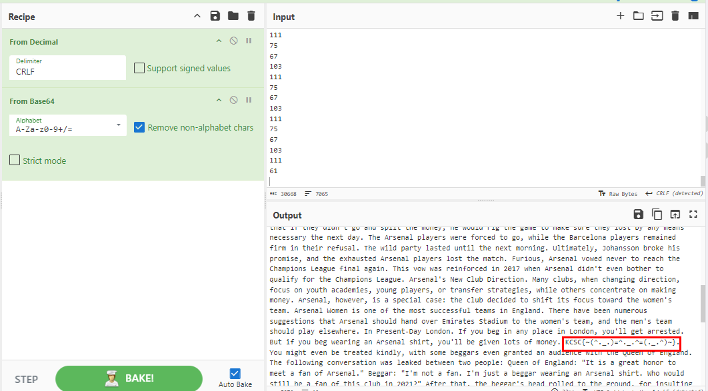
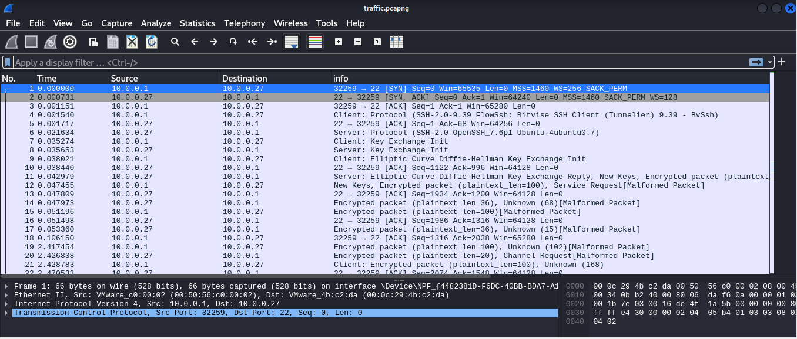
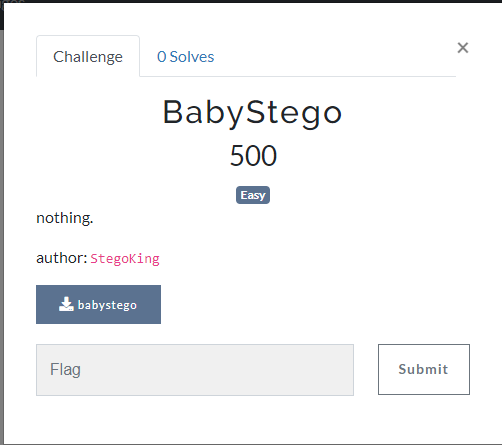
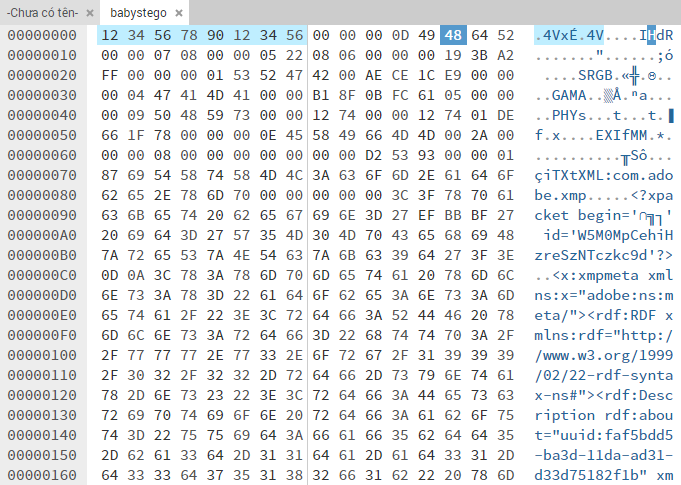

## Observation - Super weak c2 communication
### Description
- 
### Solution 
- Bài này cho chúng ta 1 file pcap. Mở file này với WireShark để tiến hành phân tích.
- 
- Nhìn vào đây ta thấy hầu hết giao thức được sử dụng là giao thức TCP 
- Ta sẽ lọc các góc TCP ra để phân tích trước, theo dõi theo các luồng 
- 
- Nếu tinh ý ta có thể thấy đây là chuỗi `Administrator` và `1.whoami` bị lật ngược.
- Tương tự với stream 1
```
1. dir
evil.py  Important.txt	lsass.DMP
```
- Và ở stream 2 ta có flag
```
1.cat Important.txt

KCSC{s1mplY_Str1ng_R3v3rseD}
```

## Observation - Credentials
### Description 
- 
### Solution 
- Tiếp tục phân tích từ những stream TCP ở trước, ta lấy khi người dùng dùng lệnh dir có 1 file lsass.DMP. Cho ai chưa biết thì 
```tệp lsass.DMP là một bản ghi (dump file) của tiến trình LSASS (Local Security Authority Subsystem Service) trên hệ thống Windows. Tệp này chứa thông tin về các phiên làm việc, mã hóa và xác thực bảo mật của hệ thống, trong đó bao gồm cả thông tin nhạy cảm như hash mật khẩu, vé Kerberos, và các dữ liệu xác thực khác. ```
- Biết là như thế nhưng ta vẫn phải kiểm tra các luồng cho chắc 

- Luồng 3
```
1.echo "Hacked"
Hacked
```
- Luồng 4 
```
1.curl http://192.168.222.164:1337/key.txt -o key.txt
```
- Luồng 5: chứa dữ liệu của file lsass.DMP.
- Luồng 6: chứa dữ liệu file key.txt : zlMg5K3TobbFh_8l7doDT_408rH7Md_W3Oc1yKX1FrA=
- Luồng 7: 
`gAAAAABm3fyvSYv0L5_jUhYRbZIoEqu4wTUG7MowDa8fWuDjSNuactBTilQyF0X1IBYT21wBcdT1CbhpPt_R3PhZDDJzymJDfQ==
gAAAAABm3fyv6sf_nGEuWEQIJXKw0zaglNW2Q-XS0tWeAwwFNbcxVnsXXPFvo7RkEMMfJ5nkx0PpioYafdDZ3HM6oCYdHeXczw==` 
- Luồng 8: `gAAAAABm3fyz0IVjfY6h-fa2mKJptEVs7I2SjEZ8cFQSArPTiKAyAZ3_AvCEBw8HzmLBCFt6IMG9MYiqaUu2-KmUj9ld5IdZtX-lD8pIyIw76iYvA0Nr0AcwSVgZg_MX-bAaOfg9-V8D
gAAAAABm3fyzXrPS6uqlPN43UafqZXDDPJgWp5E_aEaduGuo5l1icUS0elmIc0YocpZ2J-QtWKZqC4K8bFTRiyoV4d4Fy1ZZY7EZcGJ9U5CB28wxkP9PCf258M781_5613ztO-DITpGc`
- Dữ liệu này mình chưa xác định được, có thể nó là 1 loại mã hoá gì đó .
- Tổng quan: Kẻ tấn công đã lợi dụng tệp dữ liệu chưuas thông tin xác thực lsass.DMP để đánh căos dữ liệu xác thực 
- Ta sẽ sử dụng PyPyKatz để dump mật khẩu xác thực ra
> pypykatz lsa minidump lsass.DMP
```
        == MSV ==
                Username: Nex0
                Domain: DESKTOP-3VTC3DJ
                LM: NA
                NT: b454f6b76845c841d6c703a6cafd3def
                SHA1: 2d0381759171f397255a3679985fc2d2361f1e1d
                DPAPI: NA

```
- Tuy nhiên mật khẩu đã bị mã hoá ta sử dụng công cụ tại https://crackstation.net/ để crack
- 

> Flag : KCSC{FrostBite}

## Observation - No more weakness
### Desciption 
- 
### Solution 
- Nhìn vào description ta thấy rằng nó đề cập đến luồng dữ liệu thứ 7 và 8. Có vẻ đây là 1 loại mã hoá gì đấy.
- Sau 1 hồi tra google có thể nó liên quan đến thư viện fernet của python - https://www.geeksforgeeks.org/fernet-symmetric-encryption-using-cryptography-module-in-python/
- Dựa vào đây ta viết script giải mã 
```
from cryptography.fernet import Fernet
key = b'zlMg5K3TobbFh_8l7doDT_408rH7Md_W3Oc1yKX1FrA='
fernet = Fernet(key)

encrypted_message = b'gAAAAABm3fyzXrPS6uqlPN43UafqZXDDPJgWp5E_aEaduGuo5l1icUS0elmIc0YocpZ2J-QtWKZqC4K8bFTRiyoV4d4Fy1ZZY7EZcGJ9U5CB28wxkP9PCf258M781_5613ztO-DITpGc'

decrypted_message = fernet.decrypt(encrypted_message)

print(decrypted_message.decode('utf-8'))
```
> Flag : KCSC{Y0u_Kn0w_F__E__R__N__E__T!!}

## Showdown
### Desciption
- 
### Solution
- Bài này đề cho ta 1 file png và bắt ta stego xem nó có gì 
- 
- Với mấy bài stego như này mình bắt đầu bằng việc up lên `https://www.aperisolve.com/` thì có flag 🤡
- 
- 
> Flag : KCSC{Th3_uNse3n_bL@de_1s_the_D34dL1357}

## Ping Flood
### Description 
- 
### Solution 
- Mở file này với Wireshark, ta có thể thấy dấu hiệu của cuộc tấn côgn DDoS ngay lập tức (rất nhiều gói tin ICMP được gửi đến)
- Unpack 1 gói ra xem thử thì ta thấy 
```
Internet Control Message Protocol
    Type: 8 (Echo (ping) request)
    Code: 53
    Checksum: 0xf7ca [correct]
    [Checksum Status: Good]
    Identifier (BE): 0 (0x0000)
    Identifier (LE): 0 (0x0000)
    Sequence Number (BE): 0 (0x0000)
    Sequence Number (LE): 0 (0x0000)
    [Response frame: 58]
```
- Tại mỗi gói ta thấy có 1  `Code` được gửi đến và trả response về.
- Mình sẽ viết lệnh để lọc đống dữ liệu này ra, sau đó ném lên CyberChef để giải mã.
> tshark -r traffic.pcapng -Y "icmp.type == 8" -Tfields -e "icmp.code" > data.txt
- 
> Flag :  KCSC{~(^._.)=^._.^=(._.^)~}
### Tham khảo 
- https://stackoverflow.com/questions/42546097/transfer-file-over-icmp

## Aidoru
### Description 
-
### Solution 
- Nhìn vào đề mình xác định ngay phải check lịch sử trình duyệt trước
- Lịch sử trình duyệt được lưu tại `Users\admin\AppData\Local\Microsoft\Edge\User Data\Default`
- 
- Thấy rằng có 1 file tên là Onlyfans_leak.zip được tải về nhưng đã bị xoá. Khi tải file xuống, file sẽ được lưu  tạm thời tại cache. 
- File cache lại được lưu tại `Users\admin\AppData\Local\Microsoft\Edge\User Data\Default\Cache`, công thêm việc ta biết rằng file zip có dung lượng tầm 7940690 byte (theo như đã thấy trên file History) nên ta dễ dàng xác định được file

```
find Cache -type f -exec sh -c 'for file; do if [ "$(xxd -p -l 2 "$file" | tr -d "\n")" = "504b" ] && [ "$(stat -c%s "$file")" -eq 7940690 ]; then echo "$file"; fi; done' sh {} +
```

```
┌──(kali㉿kali)-[~/Downloads]
└─$ find Cache -type f -exec sh -c 'for file; do if [ "$(xxd -p -l 2 "$file" | tr -d "\n")" = "504b" ] && [ "$(stat -c%s "$file")" -eq 7940690 ]; then echo "$file"; fi; done' sh {} +

Cache/Cache_Data/f_000069
```
- 
- File đã bị khoá, dùng john để crack
```
┌──(kali㉿kali)-[~/Downloads]
└─$ zip2john f_000069 > hash
┌──(root㉿kali)-[/home/kali/Downloads]
└─# john --wordlist=/usr/share/wordlists/rockyou.txt hash   
Using default input encoding: UTF-8
Loaded 1 password hash (ZIP, WinZip [PBKDF2-SHA1 128/128 AVX 4x])
Cost 1 (HMAC size) is 7940474 for all loaded hashes
Will run 4 OpenMP threads
Press 'q' or Ctrl-C to abort, almost any other key for status
benjamin         (f_000069/confidential.png)     
1g 0:00:00:00 DONE (2024-09-18 04:02) 3.225g/s 13212p/s 13212c/s 13212C/s 123456..oooooo
Use the "--show" option to display all of the cracked passwords reliably
Session completed. 

```
Mở ra với mật khẩu benjamin ta có flag 
- 
> Flag : KCSC{n0w_y0u_f0und_my_s3np41_:3}

## NiceJob from niceComp
### Description 
- 
### Solution
- Đối với những bài có 2 file (1 file mem, 1 file pcap) như thế này, thông thường mình sẽ kiểm tra file mem trước vì mình thấy nó là cách tối ưu nhất.
- Mình chọn volatility2 để tiến hành phân tích. Tuy nhiên đây là file memory dump từ máy linux nên ta không có profile sẵn, vì vậy ta phải build bằng tay.
- Sử dụng plugin banner để xác định OS và phiên bản kernel 
```
0x170001a0      Linux version 5.4.0-150-generic (buildd@bos03-amd64-012) (gcc version 7.5.0 (Ubuntu 7.5.0-3ubuntu1~18.04)) #167~18.04.1-Ubuntu SMP Wed May 24 00:51:42 UTC 2023 (Ubuntu 5.4.0-150.167~18.04.1-generic 5.4.233)
```
- Khúc build profile này mình sẽ không đề cập kĩ (mọi người nên tra google cho nhanh)
- Sau khi build xong ta được 1 file zip (đây là profile ta cần), đưa nó vào `volatility/volatility/plugins/overlays/linux/` để chạy
- Như thường lệ, sử dụng plugin linux_bash để xem lịch sử command. Tuy nhiên nó đã bị xoá
```
┌──(kali㉿kali)-[~/volatility]
└─$ python2 vol.py -f /media/kali/3c227256-1e28-4ef7-a0bf-2efa1e7962d7/memory.dmp --profile=LinuxUbuntu5_4_0-150_167x64 linux_bash
Volatility Foundation Volatility Framework 2.6.1
Pid      Name                 Command Time                   Command
-------- -------------------- ------------------------------ -------
    1913 bash                 2024-09-09 10:26:02 UTC+0000   ATUH?????S??H??dH?%(
    1913 bash                 2024-09-09 10:26:02 UTC+0000   rm -rf .bash_history
    1913 bash                 2024-09-09 10:26:04 UTC+0000   ip a
    1913 bash                 2024-09-09 10:27:46 UTC+0000   sudo ./avml memory.dmp
    2054 bash                 2024-09-09 10:27:06 UTC+0000   cd ..
    2054 bash                 2024-09-09 10:27:14 UTC+0000   rm -rf .bash_history 
    2054 bash                 2024-09-09 10:27:14 UTC+0000   @
                                                                                                    
```
- Kiểm tra tiếp plugin linux_pslist thì thấy có 1 process sshd đang chạy
- 
- Quay qua file pcap cũng có giao thức ssh đang chạy, nhưng dữ liệu đã bị encrypt.
- 
- Theo góc nhìn của mình, có thể attacker truy cập từ xa vào hệ thống, sau đó xoá file.
- Ta sẽ tiến hành giải mã xem lưu lượng ssh này có gì.
- Để giải mã được ta cần phải có key mã hoá ssh, điều này ta có thể dùng file memory dump để trích xuất nó ra.
- Mình sẽ sử dụng plugin [openssh_sessionkeys.py](https://github.com/fox-it/OpenSSH-Session-Key-Recovery/blob/main/volatility2/openssh_sessionkeys.py) để trích xuất các khoá đó ra.
- Tới chỗ này mình bị struct vì khi chạy nó chạy rất lâu nên mình có in bốc cho author hỏi thì được hint rằng phải thêm `-n sshd` vào, mục đích để nó tập trung vào các tiến trình ssh
```
┌──(kali㉿kali)-[~/volatility]
└─$ python2 vol.py -f /media/kali/3c227256-1e28-4ef7-a0bf-2efa1e7962d7/memory.dmp --profile=LinuxUbuntu5_4_0-150_167x64 linux_sshkeys -n sshd
Volatility Foundation Volatility Framework 2.6.1

/\____/\
\   (_)/        OpenSSH Session Key Dumper
 \    X         By Jelle Vergeer
  \  / \
   \/
Scanning for OpenSSH sshenc structures...

Name                           Pid      PPid     Address            Name                           Key                                                                                                                              IV                                                              
------------------------------ -------- -------- ------------------ ------------------------------ -------------------------------------------------------------------------------------------------------------------------------- ----------------------------------------------------------------
sshd [sshd: lucius@pts/1  ]        2046     1952 0x0000560c469b6040 aes256-gcm@openssh.com         21e1f590925a517cbebda1b0bb7135b6e12ecdf116cde46533d40cb4d5661930                                                                 4807fb2cd72cad60e62e0c12                                        
sshd [sshd: lucius@pts/1  ]        2046     1952 0x0000560c469b9d60 aes256-gcm@openssh.com         1160dc100aed1ffafbe1975008206a20fbbf0d4867391bf8cd4f322d2aee5edc                                                                 449ad51cc044e41cf114249b                                        
```
- Đã có key và iv, ta tiến hành tạo 1 tệp json chứa nó 
```
{"task_name": "sshd", "sshenc_addr": 94108858764096, "cipher_name": "aes256-gcm@openssh.com", "key": "21e1f590925a517cbebda1b0bb7135b6e12ecdf116cde46533d40cb4d5661930", "iv": "4807fb2cd72cad60e62e0c12"}
{"task_name": "sshd", "sshenc_addr": 94108858764480, "cipher_name": "aes256-gcm@openssh.com", "key": "1160dc100aed1ffafbe1975008206a20fbbf0d4867391bf8cd4f322d2aee5edc", "iv": "449ad51cc044e41cf114249b"}
```
- Ta tiến hành decrypt bằng công cụ [OpenSSH-Network-Parser](https://github.com/fox-it/OpenSSH-Network-Parser)
- Tuy nhiên công cụ này có rất nhiều vấn đề nên ta phải fix trước, phần này có thể tham khảo [tại đây](https://xz.aliyun.com/t/13991?time__1311=GqmxnD2DyD97eGNDQ0PhhObeAK%2B34rD)

```
┌──(kali㉿kali)-[~/Downloads/OpenSSH-Network-Parser/openssh_network_parser/tools]
└─$ python2 network_parser.py -p traffic.pcapng --popt keyfile=key.json --proto ssh -o  ~/Downloads/
getrlimit: (1024, 1073741816)
/home/kali/.local/lib/python2.7/site-packages/gevent/builtins.py:93: CryptographyDeprecationWarning: Python 2 is no longer supported by the Python core team. Support for it is now deprecated in cryptography, and will be removed in the next release.
  result = _import(*args, **kwargs)
```
- Mình chỉ định đầu ra là mục Downloads, nên kiểm tra dữ liệu ở đây
- 
- Có 1 folder được tạo và chứa 1 file txt.
- 
- Ta thấy rằng có 1 file tên là `thong_tin_noi_bo.zip` và 1 loạt kí tự không xác định, đây chính là hex code của file.
- Dùng binwalk để lấy tệp ra
```
┌──(kali㉿kali)-[~/Downloads/10.0.0.1]
└─$ binwalk 2024-09-09--10-26-08.txt 

DECIMAL       HEXADECIMAL     DESCRIPTION
--------------------------------------------------------------------------------
4531          0x11B3          Unix path: /home/lucius/Downloads
4571          0x11DB          Unix path: /home/lucius/Downloads
4637          0x121D          Unix path: /home/lucius/Downloads
5301          0x14B5          Unix path: /home/lucius/Downloads/thong_tin_noi_bo.zip
5474          0x1562          Zip archive data, encrypted at least v2.0 to extract, compressed size: 7006, uncompressed size: 8291, name: secret.png
12650         0x316A          End of Zip archive, footer length: 22
12704         0x31A0          Unix path: /home/lucius/Downloads/thong_tin_noi_bo.zip
12831         0x321F          Unix path: /home/lucius/Downloads/thong_tin_noi_bo.zip
13004         0x32CC          Zip archive data, encrypted at least v2.0 to extract, compressed size: 7006, uncompressed size: 8291, name: secret.png
20180         0x4ED4          End of Zip archive, footer length: 22
```
- 
- File lại bị khoá bằng mật khẩu, crack tiếp 
```
┌──(kali㉿kali)-[~/Downloads/10.0.0.1/_2024-09-09--10-26-08.txt.extracted]
└─$ john --wordlist=/usr/share/wordlists/rockyou.txt hash
Using default input encoding: UTF-8
Loaded 1 password hash (ZIP, WinZip [PBKDF2-SHA1 128/128 AVX 4x])
Cost 1 (HMAC size) is 6978 for all loaded hashes
Will run 4 OpenMP threads
Press 'q' or Ctrl-C to abort, almost any other key for status
infected         (32CC.zip/secret.png)     
1g 0:00:00:01 DONE (2024-09-18 09:54) 0.5464g/s 15667p/s 15667c/s 15667C/s 280690..spongebob9
Use the "--show" option to display all of the cracked passwords reliably
Session completed. 
```
- Bây giờ sử dụng password `infected` để xem file bên trong thì ta có flag 
- 
> Flag : KCSC{w3ll_d0n3_you_go7_my_secr3t_n0w}

### Tham khảo 
- https://kevintk1.medium.com/htb-business-ctf-2021-forensic-compromised-1aa265b843a6
- https://xz.aliyun.com/t/13991?time__1311=GqmxnD2DyD97eGNDQ0PhhObeAK%2B34rD
- https://or1on-ctf.github.io/2021/07/27/HTB-Business-CTF-Compromise.html
- https://www.nccgroup.com/us/research-blog/decrypting-openssh-sessions-for-fun-and-profit/
- https://ctftime.org/writeup/29392

## BabyStego
### Description
- 
### Solution
- Bài này là bài stego tuy nhiên chỉ cho ta 1 file không mở được.
- Check hex code trước 
- 
- Ta thấy có 1 chunk IHDR và chunk IDAT bị hỏng => Xác định được đây là file png 
- Đầu tiên ta fix magic byte trước thông qua [đây](https://en.wikipedia.org/wiki/List_of_file_signatures).
- Thấy rằng magic byte file png là `89 50 4E 47 0D 0A 1A 0A` nên sửa chỗ này lại, tiếp theo là chunk IHdR sửa thành chunk IHDR
- Ta kiểm tra xem còn lỗi chỗ nào không bằng pngcheck
```
┌──(kali㉿kali)-[~/Downloads]
└─$ pngcheck -v 1.png 
zlib warning:  different version (expected 1.2.13, using 1.3.1)

File: 1.png (3597259 bytes)
  chunk IHDR at offset 0x0000c, length 13
    1800 x 1314 image, 32-bit RGB+alpha, non-interlaced
  chunk SRGB at offset 0x00025, length 1:  illegal (unless recently approved) unknown, public chunk
ERRORS DETECTED in 1.png
                                                                
```
- Chunk `SRGB` thay bằng `sRGB`    (cái này mọi người tự đổi sang hex nhé)
- Tiếp tục pngcheck
```
┌──(kali㉿kali)-[~/Downloads]
└─$ pngcheck -v 2.png
zlib warning:  different version (expected 1.2.13, using 1.3.1)

File: 2.png (3597259 bytes)
  chunk IHDR at offset 0x0000c, length 13
    1800 x 1314 image, 32-bit RGB+alpha, non-interlaced
  chunk sRGB at offset 0x00025, length 1
    rendering intent = perceptual
  chunk GAMA at offset 0x00032, length 4:  illegal (unless recently approved) unknown, public chunk
ERRORS DETECTED in 2.png
```
- Chunk GAMA tại offset 0x00032 lỗi tiếp => gAMA
```
──(kali㉿kali)-[~/Downloads]
└─$ pngcheck -v 3.png
zlib warning:  different version (expected 1.2.13, using 1.3.1)

File: 3.png (3597259 bytes)
  chunk IHDR at offset 0x0000c, length 13
    1800 x 1314 image, 32-bit RGB+alpha, non-interlaced
  chunk sRGB at offset 0x00025, length 1
    rendering intent = perceptual
  chunk gAMA at offset 0x00032, length 4: 0.45455
  chunk PHYs at offset 0x00042, length 9:  illegal critical, safe-to-copy chunk
ERRORS DETECTED in 3.png

```
- chunk PHYs => pHYs
```
┌──(kali㉿kali)-[~/Downloads]
└─$ pngcheck -v 4.png
zlib warning:  different version (expected 1.2.13, using 1.3.1)

File: 4.png (3597259 bytes)
  chunk IHDR at offset 0x0000c, length 13
    1800 x 1314 image, 32-bit RGB+alpha, non-interlaced
  chunk sRGB at offset 0x00025, length 1
    rendering intent = perceptual
  chunk gAMA at offset 0x00032, length 4: 0.45455
  chunk pHYs at offset 0x00042, length 9: 4724x4724 pixels/meter (120 dpi)
  chunk EXIf at offset 0x00057, length 14:  illegal critical, safe-to-copy chunk
ERRORS DETECTED in 4.png
```
- Chunk EXIf => eXIf
- Tiếp theo là IDAT, tất cả các chunk IDAT bị đổi thành IDaT nên ta phải sửa lại, vì có nhiều nên ta dùng script
```
def replace_bytes_in_file(file_path, old_bytes, new_bytes):
    # Chuyển đổi danh sách byte thành các đối tượng bytes
    old_bytes = bytes(old_bytes)
    new_bytes = bytes(new_bytes)

    # Đọc toàn bộ nội dung tệp vào một đối tượng bytes
    with open(file_path, 'rb') as file:
        content = file.read()

    # Thay thế tất cả các byte cũ bằng các byte mới
    modified_content = content.replace(old_bytes, new_bytes)

    # Ghi nội dung đã thay đổi vào tệp
    with open(file_path, 'wb') as file:
        file.write(modified_content)

# Đường dẫn đến tệp cần thay thế
file_path = '5.png'

# Các byte cần thay thế và thay thế bằng
old_bytes = [0x49, 0x44, 0x61, 0x54]
new_bytes = [0x49, 0x44, 0x41, 0x54]

# Gọi hàm để thực hiện thay thế
replace_bytes_in_file(file_path, old_bytes, new_bytes)
```
- Cuối cùng ta thu được flag 
- 
