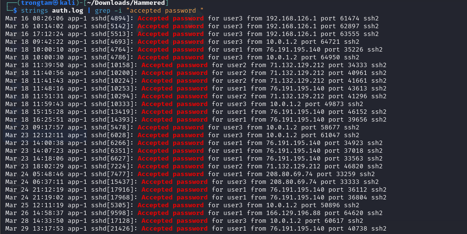

## Giải 
### Which service did the attackers use to gain access to the system?
- Sau quá trình phân tích log em thấy có rất nhiều đăng nhập bị failed
- 
### What is the operating system version of the targeted system? (one word)
- Dựa vào 1 vài kiến thức em đã tìm hiểu về log của linux em biết được `kern.log` là nơi chứa các thông tin về hệ điều hành
- Em tiến hành check thử file kern.log 
- 
> 4.2.4-1ubuntu3
### What is the name of the compromised account?
- Để kiểm tra được tài khoản bị xâm nhập em phải kiểm tra tài khoản nào đã bị login thành công thông qua attacker
- Em sẽ dùng filter `Accepted password` để tìm kiếm 
- 
- Có thể thấy rất nhiều tài khoản đã đăng nhập thành công
- Em sẽ tiếp tục kiểm tra các đoạn log trước để xem thử tài khoản nào bị failed khi login

### Consider that each unique IP represents a different attacker. How many attackers were able to get access to the system?
- Chúng ta đã biết tài khoản bị xâm nhập là root, em sẽ viết 1 đoạn command lọc các user là root và đăng nhập không thành công (authentication failure)
> strings auth.log | grep "authentication failure" | grep "user=root" 
```text
┌──(trongtam㉿kali)-[~/Downloads/Hammered]
└─$ strings auth.log | grep "authentication failure" | grep "user=root"  
Mar 18 11:20:17 app-1 su[9504]: pam_unix(su:auth): authentication failure; logname=user1 uid=1001 euid=0 tty=pts/0 ruser=user1 rhost=  user=root
Mar 18 11:20:24 app-1 su[9506]: pam_unix(su:auth): authentication failure; logname=user1 uid=1001 euid=0 tty=pts/0 ruser=user1 rhost=  user=root
Mar 18 17:01:15 app-1 su[14542]: pam_unix(su:auth): authentication failure; logname=user3 uid=1000 euid=0 tty=pts/1 ruser=user3 rhost=  user=root
Apr 18 18:22:07 app-1 sshd[5266]: pam_unix(sshd:auth): authentication failure; logname= uid=0 euid=0 tty=ssh ruser= rhost=61.151.246.140  user=root
Apr 18 18:22:11 app-1 sshd[5268]: pam_unix(sshd:auth): authentication failure; logname= uid=0 euid=0 tty=ssh ruser= rhost=61.151.246.140  user=root
Apr 18 18:22:15 app-1 sshd[5270]: pam_unix(sshd:auth): authentication failure; logname= uid=0 euid=0 tty=ssh ruser= rhost=61.151.246.140  user=root
Apr 18 18:22:18 app-1 sshd[5272]: pam_unix(sshd:auth): authentication failure; logname= uid=0 euid=0 tty=ssh ruser= rhost=61.151.246.140  user=root
Apr 18 18:22:22 app-1 sshd[5274]: pam_unix(sshd:auth): authentication failure; logname= uid=0 euid=0 tty=ssh ruser= rhost=61.151.246.140  user=root
...
```
- Có thể thấy ở đây có rất nhiều ip bị lặp nhau. Ý tưởng của em xoá các ip trùng nhau, để làm được em phải lọc được ip ra sau đó dùng uniq để in trên 1 dòng 
```
┌──(trongtam㉿kali)-[~/Downloads/Hammered]
└─$ strings auth.log | grep "authentication failure" | grep "user=root" | cut -c 124- | sed 's/user=root//' | sort | uniq -u
.128  
12.172.224.140  
122.165.9.200  
124.51.108.68  
4.52.185.9  
65.208.122.48  

```
- Lệnh cut -c 124- cắt chuỗi từ kí tự có chỉ số 124 trở về sau 
- lệnh sed 's/user=root//' : thay thế user=root thành 1 kí tự trống
- sort : Sắp xếp
- uniq -u : in mỗi cái dòng (khác nhau)
> 6
### Which attacker's IP address successfully logged into the system the most number of times?
- Đầu tiên em sẽ lọc các đăng nhập thành công vào tài khoản root
```
strings auth.log | grep "Accepted password" | grep "for root" | cut -b 64- | cut -b -19 | uniq -c
      1 rom 10.0.1.2 port 5
      2 om 219.150.161.20 p
      2 rom 219.150.161.20 
      1 rom 222.66.204.246 
      1 rom 201.229.176.217
      1 rom 190.167.70.87 p
      3 om 190.166.87.164 p
      1 rom 121.11.66.70 po
      1 om 193.1.186.197 po
      1 om 151.81.205.100 p
      1 om 151.82.3.201 por
      1 om 151.81.204.141 p
      1 om 222.169.224.197 
      2 rom 122.226.202.12 
      1 rom 121.11.66.70 po
      1 rom 61.168.227.12 p
      1 rom 188.131.22.69 p
      1 rom 190.167.74.184 
      1 om 94.52.185.9 port
      4 rom 188.131.23.37 p
```
- Tuy nhiên trong này có 1 số ip của người dùng, em sẽ check từng ip để xem cái nào là của attacker
> strings auth.log | grep -B 5 "219.150.161.20"
> Câu trả lời `219.150.161.20`
### How many requests were sent to the Apache Server?